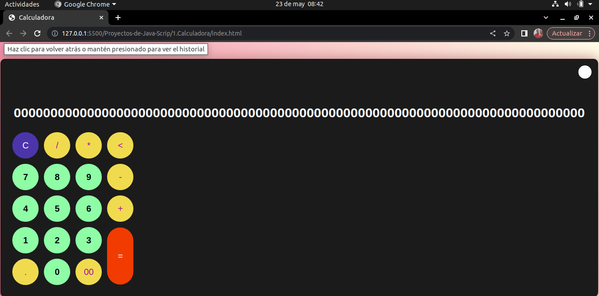

# Proyetos JavaScript

## EJERCICIO 1

### Introducción 

#### El sitio web es de una calculadora funcional hecha con HTML, CSS y JAVASCRIPT.

### Index.HTML

#### En el index se hace la escrututa de la calculadora creando los botones y el modelo inicial de la pagina. 

### Style.CSS

#### Crea un decorado colorido que cambia radicalmente el diseño creando un fondo poniendo bordes, agrandando la calculadora y poniedo colores.

### Script.js

##### Permite las funciones aritmeticas para el correcto funcionamiento de la calculadora.

## EJERCICIO 2

### Introducción

#### Es un menu para pantallas principales.

### Index.HTML

#### Es una lista llena de link con distintas imagenes y nombres.

### Style.CSS

#### Organisa la lista demanera desendente, coloca fondos negro y una bara de menu.

### Scrip.JS

#### Le da un funcion de movimenento a el menu junto a un despliege

## EJERCICIO 3

### Introdución

#### Es una notificacion de texto quese abre en ventana

### Index.HTML
